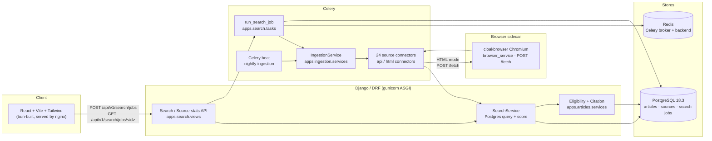

# cindex

[](https://github.com/4q4r/cindex/actions/workflows/ci.yml)
[](https://www.python.org/downloads/)
[](https://www.djangoproject.com/)
[](https://react.dev/)
[](https://docs.astral.sh/ruff/)
[](#quality-gate)
[](https://www.postgresql.org/)

Cross-regional **scholarly citation search engine** that ingests open-access
article sources, scores each article against a four-criteria eligibility model,
and serves ranked results with copy-ready citations — all backed entirely by
**PostgreSQL** (no external vector store or search index).

> The frontend is Russian-language; the codebase and API are English.

---

## Architecture



Request flow:

1. The browser submits a query to `POST /api/v1/search/jobs`, creating a
   `SearchJob` and enqueueing `run_search_job` on Celery.
2. The frontend polls `GET /api/v1/search/jobs/<uuid>` for progress and the
   paginated result page.
3. `SearchService` runs the ranked search **entirely in PostgreSQL** — an
   `icontains` OR-tree over title / abstract / full-text / journal / DOI,
   annotated with a weighted `Case`/`When` score expression, cross-lingual term
   expansion, source penalty, and article-level deduplication (DOI, or
   title + year + journal).
4. If indexed hits are stale or absent, `IngestionService` re-scans the live
   sources through 24 connectors, persists eligible articles, and the job
   completes (status `completed`, `partial`, or `failed`).

---

## Stack

| Layer     | Technology                                                                                              |
| --------- | ------------------------------------------------------------------------------------------------------- |
| Backend   | Django 5.2+, Django REST Framework, drf-spectacular, pydantic-settings, django-structlog                |
| Async     | Celery 5 with Redis broker/result backend; Celery beat for nightly ingestion                            |
| Database  | PostgreSQL 18.3 (`psycopg`) — the only persistence and search store                                     |
| Search    | `SearchService` — Postgres `icontains` + weighted `Case/When` scoring (no FTS dependency at this layer) |
| Ingestion | `cloakbrowser` Chromium sidecar (HTML) + `aiohttp` (API) connectors with circuit-breaker and retry      |
| Frontend  | React 19, Vite 7, TypeScript 5.9, Tailwind 4 (built with **bun**)                                       |
| Runtime   | `gcr.io/distroless/python3-debian13` (non-root, no shell), gunicorn ASGI                                |
| Edge      | nginx serving the built frontend and proxying `/api` to the Django app                                  |
| Tooling   | `uv` for Python, `ruff` for lint/format, `pytest` + `coverage` for tests                                |

---

## Project structure

```
apps/
  articles/      Article, Source, Author models; eligibility + citation services
  core/          Settings-backed app config, healthcheck, text/translate helpers
  ingestion/     Connectors (api/html), IngestionService, live query matrix, fulltext resolver
  search/        SearchService, SearchJob model, Celery tasks, DRF views
  users/         User model
config/          Django settings, ASGI/WSGI, Celery app, gunicorn config
frontend/        React + Vite + Tailwind client (bun-managed)
nginx/           Reverse-proxy config
browser_service/ Browser sidecar (cloakbrowser Chromium, FastAPI) for HTML connectors
Dockerfile       Multi-stage build → distroless runtime
docker-compose.yml   app + celery worker/beat + browser sidecar + postgres + redis + nginx
.github/workflows/ci.yml   lint, unit tests, scheduled live smoke/quality
docs/archive/    Historical (abandoned-stack) documents — see its README
```

---

## Search pipeline

`apps/search/services.py` (`SearchService`) is the search entry point:

- **Query normalization** — `normalize_scholarly_text` + cross-lingual term
  expansion via `expand_search_terms`.
- **Filter expression** — an OR-tree of `Q(field__icontains=term)` across
  `title`, `abstract`, `full_text`, `journal__name`, `doi`.
- **Scoring** — `Case`/`When` weighted contributions
  (DOI 10 · title 6 · abstract 4 · full-text 2 · journal 1), with a 0.5× weight
  for cross-lingual tokens and a multiplicative source penalty
  (e.g. `zenodo` 0.3). Ordering is `(-search_score, -publication_year,
-updated_at, id)` for deterministic ranking.
- **Truncation** — server-side top-K of `settings.APP.search_final_top_k`
  (default `30`).
- **Deduplication** — by normalized DOI, or by canonical
  `title + year + journal` key.
- **Serialization** — `_payload` builds the API shape with eligibility evidence
  and confidence scores.

---

## Ingestion connectors

24 open-access sources registered in `apps/ingestion/connectors/registry.py`:

- **API mode (`aiohttp`):** Europe PMC, OpenAlex, Crossref, PubMed, arXiv, DOAJ,
  PMC, CORE, DBLP, HAL, Zenodo, IACR, and the optional Exa connector
  (enabled only when `EXA_API_KEY` is set).
- **HTML mode (`cloakbrowser` sidecar):** CiNii, SciEngine, CyberLeninka, MathNet,
  SciELO, Persee, OpenEdition, Medknow, DergiPark, Hrcak, AJOL.

HTML-mode connectors do not import a browser stack. They call a small FastAPI
sidecar (`browser_service/`, `POST /fetch`) that owns a single persistent
source-patched Chromium context (cloakbrowser, `humanize=True`,
`human_preset="careful"`) and returns the raw server body for HTML/XML/JSON/RSS.
This passes JS challenges (BunnyCDN Shield, Cloudflare Turnstile, FingerprintJS)
that Cloudflare-only scrapers cannot. The worker reaches it at
`CINDEX_BROWSER_URL` (default `http://browser:8081`) over the internal docker
network. See `browser_service/README.md` for the sidecar contract.

Each connector implements a `BaseConnector` contract with source-specific
selectors and evidence mapping. `IngestionService` wraps the fan-out with a
circuit-breaker (per-source failure threshold + cooldown) and records source
health telemetry. The `live_quality` and `live_smoke` CI markers exercise the
connectors against real endpoints on a schedule.

---

## Eligibility and citations

Every article is scored against four criteria
(`apps/articles/services.py` and the `Article` model):

- `peer_reviewed` — peer-reviewed / refereed venue
- `indexed` — indexed in a reputable bibliographic database
- `doi_and_journal_card` — has a DOI and a recognizable journal card
- `not_preprint` — not a preprint (or is an author-manuscript version)

Each criterion carries a confidence value; `eligibility_confidence.overall`
drives ranking. The frontend renders copy-ready citations in GOST 2018, MLA,
APA, Vancouver, IEEE, and Harvard styles (citation style is a client-side
display preference).

---

## Async search jobs

The public API is job-based so long-running live scans stay off the request
thread:

| Method | Path                         | Purpose                                              |
| ------ | ---------------------------- | ---------------------------------------------------- |
| POST   | `/api/v1/search/jobs`        | Create a `SearchJob` and enqueue `run_search_job`    |
| GET    | `/api/v1/search/jobs/<uuid>` | Poll status, progress, and the paginated result page |
| GET    | `/api/v1/source-stats`       | Source health summary for the UI                     |

`run_search_job` (`apps/search/tasks.py`) decides whether a live rescan is
needed (stale query scan, empty index hits, or `force_refresh`), fans out to
the connectors, streams progress events to the job record, and falls back to
supplemental enrichment for stale/failed sources. Terminal status is
`completed`, `partial` (some sources failed), or `failed`.

---

## Frontend

The client under `frontend/` is a React 19 + Vite 7 + Tailwind 4 single-page
app managed with **bun** (do not use npm). It submits a search job, polls for
progress, and renders ranked result cards with citation/snippet copy actions.
nginx serves the built bundle (`frontend/dist`) and proxies `/api` to the
Django app.

```bash
cd frontend
bun install
bun run build      # production bundle to frontend/dist
bun run dev        # local dev server
```

---

## Deployment (Docker)

`docker-compose.yml` brings up the full stack: Django app, Celery worker, Celery
beat, the browser sidecar (cloakbrowser Chromium), PostgreSQL 18.3, Redis 8,
the built frontend, and nginx. Secrets (`postgres_password`, `secret_key`) are
provided as files via Docker secrets, not environment literals. The app/worker
runtime image is distroless and runs as a non-root user with no shell; only the
browser sidecar carries a slim Python + Chromium runtime (it cannot be
distroless because Chromium needs shared libraries). The worker reaches the
sidecar at `CINDEX_BROWSER_URL` (default `http://browser:8081`) and depends on
its health check before starting.

```bash
docker compose up -d --build
docker compose exec app python manage.py migrate
```

Health: the app container hits `/api/health/`; nginx exposes the frontend on
port 80.

---

## Local development

Python is managed with `uv`:

```bash
uv sync --group dev
uv run python manage.py migrate
uv run python manage.py runserver
uv run celery -A config worker -l info
```

Configuration is via environment variables (loaded through `pydantic-settings`
`AppSettings`). Copy `.env.example` to `.env` and fill in the required values.
Use `YOUR_API_KEY` placeholders for any third-party keys in examples — never
commit real secrets.

---

## Testing and quality gate

The CI workflow (`.github/workflows/ci.yml`) runs ruff and the unit suite on
every push and PR, and schedules live source smoke/quality checks nightly.

```bash
# Lint and format
uv run ruff check .
uv run ruff format --check .

# Unit tests (excludes live network markers) on SQLite
DATABASE_URL=sqlite:///test.sqlite3 uv run pytest -q -m "not live_smoke and not live_quality"

# Live source checks (real network, scheduled in CI)
uv run pytest -q -m live_smoke
uv run pytest -q -m live_quality
```

### Quality gate

- `ruff check .` — 0 errors, 0 warnings.
- `pytest` with `--cov=apps --cov-fail-under=80` — coverage gate at 80%.
- `python manage.py check` and `python manage.py makemigrations --check` — no
  pending schema changes.

---

## Documentation

- `README.md` (this file) — current architecture and operations.
- `LIVE_QUERY_POLICY.md` — policy for the `SOURCE_QUERY_MATRIX` live stability
  gate.
- `docs/archive/` — historical documents describing the abandoned
  Chroma/Elasticsearch/Qdrant/Next.js stack, kept for provenance only. Read the
  source under `apps/` and `frontend/` for the running system.
